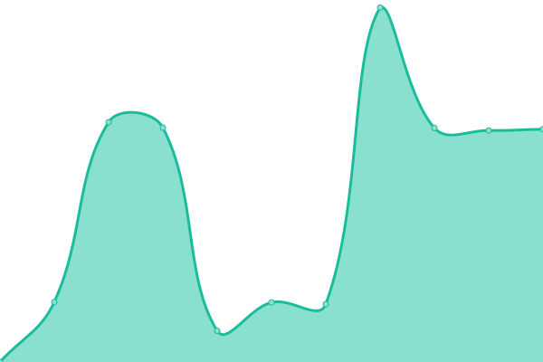
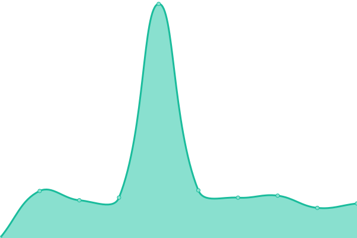
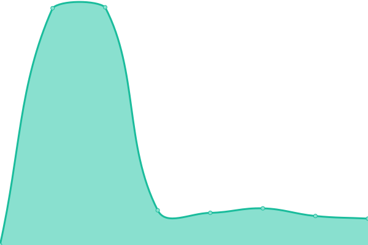

# [📈 Live Status](https://status.8by3.com): <!--live status--> **🟩 All systems operational**

This repository contains the open-source uptime monitor and status page for [S. B. Ramin](https://8by3.com), powered by [Upptime](https://github.com/upptime/upptime).

With [Upptime](https://upptime.js.org), you can get your own unlimited and free uptime monitor and status page, powered entirely by a GitHub repository. We use [Issues](https://github.com/sbramin/8by3-health/issues) as incident reports, [Actions](https://github.com/sbramin/8by3-health/actions) as uptime monitors, and [Pages](https://status.8by3.com) for the status page.

<!--start: status pages-->
<!-- This summary is generated by Upptime (https://github.com/upptime/upptime) -->
<!-- Do not edit this manually, your changes will be overwritten -->
<!-- prettier-ignore -->
| URL | Status | History | Response Time | Uptime |
| --- | ------ | ------- | ------------- | ------ |
|  [Helyi](https://helyi.net) | 🟩 Up | [helyi.yml](https://github.com/sbramin/8by3-health/commits/HEAD/history/helyi.yml) | 

 2094ms
     
 | 

<a href="https://status.8by3.com/history/helyi">99.10%</a>
    

|  [Winkl](https://winkl.net) | 🟩 Up | [winkl.yml](https://github.com/sbramin/8by3-health/commits/HEAD/history/winkl.yml) | 

 728ms
     
 | 

<a href="https://status.8by3.com/history/winkl">100.00%</a>
    

|  [8by3](https://8by3.com) | 🟩 Up | [8by3.yml](https://github.com/sbramin/8by3-health/commits/HEAD/history/8by3.yml) | 

 1761ms
     
 | 

<a href="https://status.8by3.com/history/8by3">100.00%</a>
    

|  [Terug](https://terug.co.za) | 🟩 Up | [terug.yml](https://github.com/sbramin/8by3-health/commits/HEAD/history/terug.yml) | 

 2123ms
     
 | 

<a href="https://status.8by3.com/history/terug">100.00%</a>
    

|  [Werkr](https://werkr.co.za) | 🟩 Up | [werkr.yml](https://github.com/sbramin/8by3-health/commits/HEAD/history/werkr.yml) | 

 1518ms
     
 | 

<a href="https://status.8by3.com/history/werkr">89.27%</a>
    

|  [Tuhat](https://tuhat.net) | 🟩 Up | [tuhat.yml](https://github.com/sbramin/8by3-health/commits/HEAD/history/tuhat.yml) | 

 1859ms
     
 | 

<a href="https://status.8by3.com/history/tuhat">99.83%</a>
    

|  [Brug](https://brug.co.za) | 🟩 Up | [brug.yml](https://github.com/sbramin/8by3-health/commits/HEAD/history/brug.yml) | 

 1672ms
     
 | 

<a href="https://status.8by3.com/history/brug">99.84%</a>
    

<!--end: status pages-->

[**Visit our status website →**](https://status.8by3.com)

## 📄 License

- Powered by: [Upptime](https://github.com/upptime/upptime)
- Code: [MIT](./LICENSE) © [Anand Chowdhary](https://anandchowdhary.com), supported by [Pabio](https://pabio.com)
- Data in the `./history` directory: [Open Database License](https://opendatacommons.org/licenses/odbl/1-0/)
